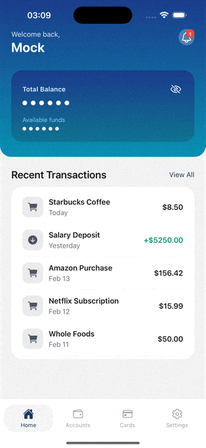
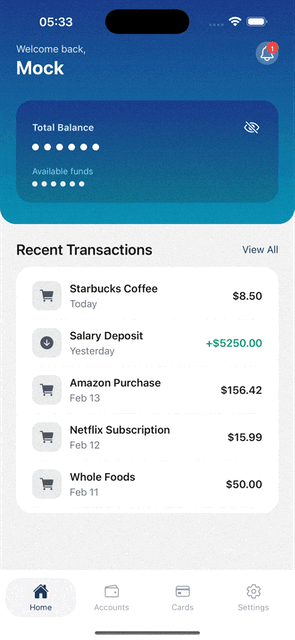

# Banking Mobile

Expo (React Native) app with **Clean Architecture** and a local mock API for development.

- **Stack:** Expo, React Native, TypeScript
- **Architecture:** domain → data → presentation, with shared config and UI

---

## Table of contents

- [Get started](#get-started)
- [Demos](#demos)
- [Scripts](#scripts)
- [Environment](#environment)
- [Project structure](#project-structure)
- [Auth flow](#auth-flow)
- [Documentation](#documentation)
- [Learn more](#learn-more)

---

## Get started

**1. Install dependencies**

```bash
npm install
```

**2. Run the app (recommended)** — mock API + Expo in one terminal

```bash
npm run dev
```

Mock API runs at `http://localhost:3099`; in `__DEV__` the app uses it automatically. Press `i` for iOS simulator or `a` for Android.

**3. Run without mocks**

```bash
npm start
```

To disable mocks: `EXPO_PUBLIC_USE_MOCKS=false`. The app then uses `EXPO_PUBLIC_API_URL` (default `https://api.example.com`).

---

## Demos

| Screen | Preview |
|--------|--------|
| **Home** |  |
| **Cards** |  |

---

## Scripts

| Script | Description |
|--------|-------------|
| `npm run dev` | Mock server + Expo (one terminal) |
| `npm start` | Expo only |
| `npm run mock:server` | Mock API only (port 3099) |
| `npm run typecheck` | TypeScript check |
| `npm run lint` | ESLint (Expo config) |

---

## Environment

| Variable | Purpose |
|---------|---------|
| `EXPO_PUBLIC_USE_MOCKS` | `true` / `false`. In `__DEV__`, mocks default **on** unless set to `false`. |
| `EXPO_PUBLIC_API_URL` | API base URL. With mocks, default is `http://localhost:3099`. Use your machine IP for a physical device (e.g. `http://192.168.1.x:3099`). |
| `EXPO_PUBLIC_MOCK_AUTH` | Set to `logged_in` so `GET /auth/me` returns 200 and the app opens on (tabs) instead of the welcome screen. |
| `EXPO_PUBLIC_LOG_LEVEL` | `debug` \| `info` \| `warn` \| `error`. Default: `info` in dev, `warn` otherwise. |

---

## Project structure

| Folder | Role |
|--------|------|
| **`app/`** | Expo Router routes: `_layout.tsx`, index auth gate, welcome, `(tabs)`. |
| **`assets/`** | Static assets. `assets/icons/` — SVG icons (via `react-native-svg-transformer`). See [assets/icons/README.md](assets/icons/README.md). |
| **`src/`** | Application code (Clean Architecture). See [src/README.md](src/README.md) for folder tree and layer roles. |

**Flow:** **domain** (entities, use cases, repository interfaces) → **data** (API client, repository implementations) → **presentation** (screens, components, hooks). **shared** — config, theme, logger, UI primitives. **src/core** — DI (`getRepos`, `getUseCases`, `getAuthStatus`), providers, navigation. **src/mocks** — MSW handlers for Node tests; the app uses the local mock server in `scripts/mock-server.js`.

---

## Auth flow

- On launch the app calls `GET /auth/me`. **401** → Welcome screen; **2xx** → (tabs).
- With the mock server, 401 is default. To simulate logged in:

```bash
EXPO_PUBLIC_MOCK_AUTH=logged_in npm run dev
```

---

## Documentation

| Doc | Description |
|-----|-------------|
| [src/README.md](src/README.md) | Clean Architecture folder tree and layer roles |
| [docs/msw-setup.md](docs/msw-setup.md) | MSW and mock-first setup (app uses local mock server) |
| [docs/migration-clean-architecture.md](docs/migration-clean-architecture.md) | Migration plan: Clean Architecture + mocks |
| [docs/refinement-clean-arch.md](docs/refinement-clean-arch.md) | Refinements and boundaries |
| [docs/migration-root-to-src.md](docs/migration-root-to-src.md) | Moving code into `src/` |
| [docs/refactor-fsd-to-clean-arch.md](docs/refactor-fsd-to-clean-arch.md) | Refactor from FSD to Clean Architecture |

---

## Learn more

- [Expo documentation](https://docs.expo.dev/)
- [Expo Router](https://docs.expo.dev/router/introduction/)
